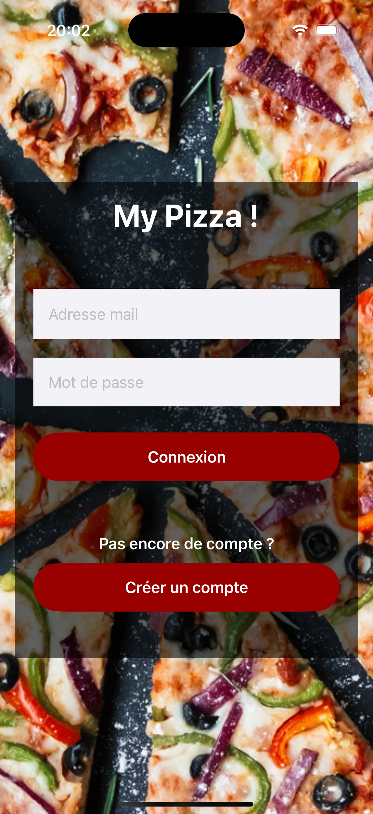
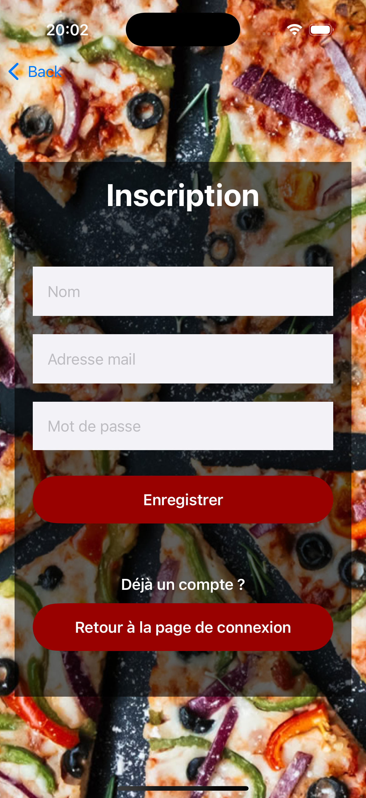
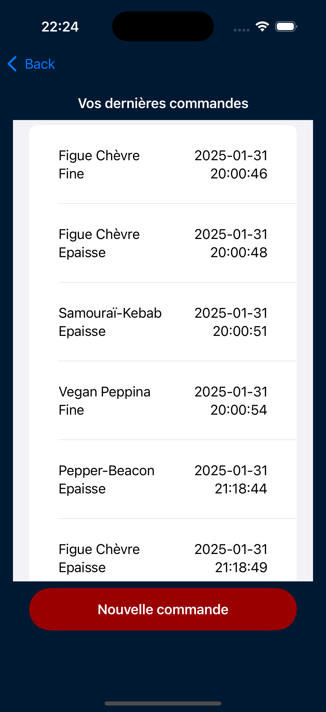
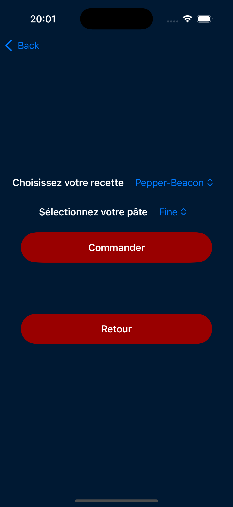

# MyPizza 🍕 - IOS Mobile Application for Ordering Pizza
| [](https://www.ube.fr) | Polytech Dijon - 4A - ILIA <br/> SwiftUI&nbsp;Mobile&nbsp;App&nbsp;Project&nbsp;<br/><br/> **[ MY PIZZA ]**<br/>| [](https://polytech.ube.fr) |
|:-------------------------------------------------------------|:-------------------------------------------------------------------------------------------------------------------------------------------------------------------------------:|-----------------------------------------------------------------------------------------:|


## Table of Contents  
- [Project Description](#project-description)  
- [Implemented Features](#implemented-features)  
- [Installation](#installation)  
- [Screenshots](#screenshots)  
  - [Login and Register](#login-and-register)  
  - [Home Page](#home-page)  
  - [Order Management](#order-management)  

## Project Description  
**MyPizza** is an iOS application developed with SwiftUI that allows users to create an account and make or manage their pizza orders. This application leverages a pre-existing API to provide an intuitive interface with features tailored to user needs.

## Implemented Features  

### Core Features  
1. **User Authentication** [screenshots](#login-and-register)  
   - Create an account with email and password.  
   - Secure login with authentication token storage.   

3. **Order Management** [screenshots](#order-management)  
   - Make an order.
   - View order history with details.  

## Installation  
1. Clone the repository:
   ```bash  
   git clone https://github.com/Noureddine-t/MyPizza.git
    ```
2. Open the project in **Xcode**.
3. Run the application on an **iOS Simulator** or a **physical device**.  
4. Launch the app and either:  
   - **Create a new account** or  
   - **Use the guest account**:  
     - **Email**: `guest@gmail.com`  
     - **Password**: `guest`  

> [!Caution] 
> You need a mac in order to use Xcode and run the application.

## Screenshots  

### Login and Register
 

### Order Management
   
